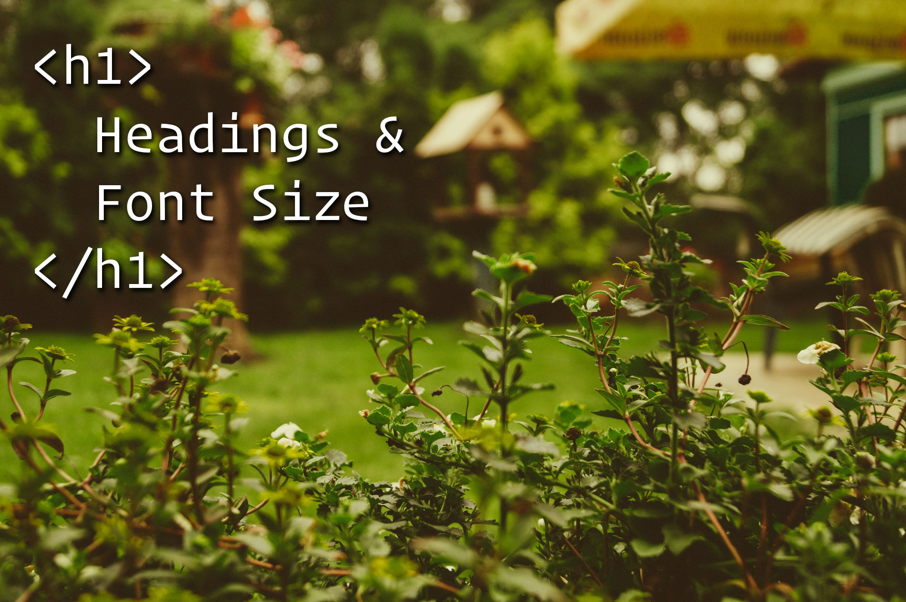

## The Right Heading

I often hear from clients or designers that they'd like to see a font size larger or smaller, so I should "make it an H5 instead of an H4". In their mind, an H5, H4, or any heading element merely represents a specific font size, any usually nothing more. Interestingly, this is what [The MDN has to say about that notion](https://developer.mozilla.org/en-US/docs/Web/HTML/Element/Heading_Elements#Usage_notes):

> Do not use lower levels to decrease heading font size: use the CSS font-size property instead.

So why is it such a common idea to change font size using various HTML elements? It's a leftover from *the ancient times* of Web 1.0. Back when your HTML document contained no CSS, and was styled entirely by usage of particular elements (like `<b>`, `<i>`, `
`, and so on). If you wanted a vertical space between two elements, you'd add a ` `. If you wanted a bottom border to an element, you'd have to use an `
`. Our entire concept of design was in how we used HTML elements. Changes to design required modifying markup. It was sort of a big ugly mess.

## A Better Way

Enter CSS. It wasn't even considered a promising technology at first. Developers didn't like how inconsistent it was across browsers. It was considered a headache to some while a blessing to others. Fast forward *22 years* and CSS is in much better shape. It's been iterated on and improved several times. It's arguably a mandatory technology for any web-based application or website. Nowadays CSS can do *nearly everything*. Modifying font size is trivial.

The primary benefit of CSS is decoupling your markup and design. Changes to one shouldn't negatively impact the other. Designing a website within the HTML markup should be a thing of the past. You write the HTML, add classes and IDs, and then shouldn't need to modify it much to develop and modify your design. I believe [CSS Zen Garden](http://www.csszengarden.com/) illustrates this concept well. The markup does not change between permutations, but you can see the design is radically different between each one.

With the availability and flexibility of CSS, why would a designer instruct me to modify an H4 into an H5 to reduce font size? It might be a habit from an older time, or it could be a lack of knowledge. In which case I'd be happy to explain to them why CSS is a much better fit for changing font size.

## Semantics

Now that we know specific HTML elements aren't required to achieve specific font sizes, is there even a reason to use different heading elements for different purposes? The answer is yes. Headings convey a hierarchy of importance. The H1 establishes the overall topic of the page. H2s are typically headings of major sections of the page. H3s are used for more granular separation of sub topics. H4 through H6 typically aren't used, but can be used for even more granular control.

Screen readers that visually impaired individuals use rely heavily on a semantic, logical document layout &amp; flow. It's important to provide an accessible experience for everyone who may visit your website. Part of doing that is by maintaining a meaningful, semantic flow of content, which is determined significantly by which heading elements you use.

## TL;DR

If you take nothing more from this article, take this: use CSS to change the size of fonts, not particular heading elements.

---

If you agree or disagree, feel free to let me know in the comments below, or [Tweet me](https://twitter.com/josiahrooney).