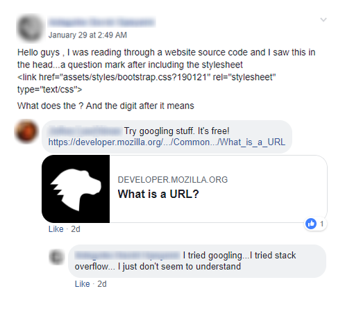

>"Google is your friend"  
>"Google it"  
>"Try Googling stuff, it's free!"  

Phrases like these are some of the most common responses I see in groups and forums meant for learning/teaching web development and programming. It's often well intentioned. After all, the best resource any programmer has is the internet. In the course of my workday, I often have several tabs open, especially to some embarrassingly novice searches (is it the action or the method of a form that should be "POST"?). Granted, in my defense I sometimes forget the basics and must pop into Google to refresh my memory.

That said, is it truly helpful to push a newcomer's question off to a search engine? Are you creating an environment where learning is encouraged? I tend to think not.

Learning how to research via search engines is a vital tool for anyone (not just programmers), but I believe if you are able to answer a question, you should. It almost takes as much effort to tell them to Google it as it is for you to simply write out a concise answer. Now, there are times when a question becomes so very common that it deserves to be added to a list of FAQs (frequently asked questions), and it's fine to point the person to those FAQs. And it's also perfectly acceptable to teach someone how to rely on a search engine. I just think the community should be more welcoming to new learners. After all, we were all there once too.

This is from a Facebook group I am part of. Sorry to the individuals in the screenshot! I didn't mean to throw you under the bus, but I wanted to use this thread to highlight my point. OP (original poster) asks a good question which shows they have a desire to learn. One of the responses is telling them to Google their question and gives a link to the MDN Web Docs (Mozilla Developer Network) documentation. In the responder's mind, they're doing OP a favor. "Here's what you need to understand URLs and query parameters". But OP responds saying they have already done some research and likely just need someone to explain it to them in simple terms.

Had the post not been locked to comments before I saw it, I would have taken the time to explain query parameters to OP and especially why they are used with CSS files in particular (that will get [its own blog post](/query-parameters-and-cache-busting/)). While I think [MDN Web Docs](https://developer.mozilla.org/en-US/) is an incredible resource, I've also found that many new developers get overwhelmed by the technical language on MDN.

Everyone learns differently. I personally learn best by watching videos and seeing code being written in real time. Others learn better from documentation and books. Still others learn better from having a personal mentor sit with them and walk them through the code. I just hope the programming community can understand that fact and not send everyone down the path that is best suited for the reader-learners. Thanks for reading!

---

If you agree or disagree with this post, please let me know in the comments below! I appreciate feedback and criticism.