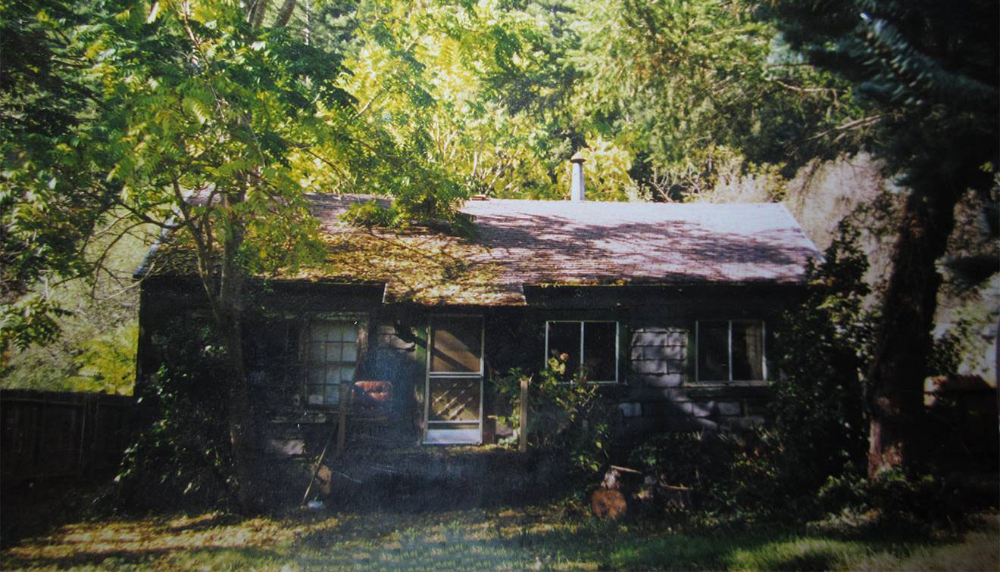

The tiny old 2 bedroom house that 7 of us called home in 1997.

## Hello World

If you were to tell the 19 year old me, back in 2005, that I would be a lead software engineer for a major web company, having a critical role in the success of their product, I would have probably laughed at you. After all, I was jobless, broke, uneducated. I made it out of high school with passing grades, but that's about all I had. I never had the chance to go to college (aside from a short stint at the City College of SF that didn't pan out due to financial problems). I would have been homeless if my dear sister hadn't offered me a couch to sleep on while I tried to salvage the wreck that was my life. This isn't a sob story, don't worry, but I am giving some necessary background.

I grew up very poor. We ate food from food banks. We had food stamps. Our source of "new" clothes was the Goodwill or donations from church. My family of 2 parents and 5 kids often lived in 2 bedroom houses. My parents struggled to pay the bills. We lost our house and all our belongings in a fire when I was a child. My dad was always chasing work opportunities, so we moved very often. As a result of all that I mentioned (and so much I can't), my chaotic, desperate childhood resulted in an adopted lackadaisical attitude toward my schooling and life in general. I never had a real opportunity to make friends since I was attending a new school every couple years. I sure had a knack for attracting bullies though. Most of my schooling from grade 7 and up was spent being bullied very aggressively. I spent more than a few times walking home trying to hold back tears as I nursed a black eye. I can be something of a contrarian, and bullies didn't take kindly to that fact.

My escape was video games. In the 1990s, as I grew up, so did video games. At the beginning of the decade they were pixelated and cutesy. At the end of the decade, they were intense and sometimes emotional experiences that helped shape entire generations of people. We didn't have a gaming console for most of my childhood, but something we did have was a personal computer. We had several different PCs over the years, starting with ancient IBM computers with monochrome orange screens. I vividly remember a video game where you operated a tank from a first person perspective and had to battle other tanks in a desert. I spent every moment I could on the family PC, despite having to compete with 4 siblings for access to it. I spent my tween years constructing Sim Towers and sending my troops to die in Command & Conquer. When video games started to bore me, I would spend the rest of my time online.

## Online

I was 8 years old when the Internet was released. I was past my formative years. The Internet fascinated me to no end. The joy and curiosity I had about the Internet is something that I don't know if kids today experience. It has become such a facet of our daily lives that they probably don't consider it any more fascinating than the water faucet or cable television. I grew up in a time when you didn't really know what was going on in the world around you. If some major disaster happened in South America, or war broke out in the Middle East, we wouldn't really know until the 7 o'clock news, or sometimes in the newspaper the next day.

The Internet changed all that. Websites sprouted like weeds. Everyone talked about "dotcom", as if it were new era for humanity. In a way, it was, but the dotcom bubble burst pretty hard. One thing that never changed about the Internet is what I consider the soul of the Internet: it is free. I don't mean free ([gratis](https://en.wiktionary.org/wiki/gratis)), but free ([libre](https://en.wiktionary.org/wiki/libre)). It is a platform that has outgrown control of any specific body. Sure, there are ISPs that control it. There are governments that can temporarily block DNS routing so their citizens can't access the Internet, but technology always adapts to those challenges. The free soul of the Internet will always remain, no matter what happens to the technology. The Internet is the expression of humanity's deepest desire in a digital form: freedom. For a teenager in the 1990s who had been shackled by poverty, abuse, and anxiety about his future, the Internet was pure dopamine that flowed directly into my brain.

I built my first website using the platform [Homestead.com](https://www.homestead.com/create-a-website) in the late 1990s. The website was meant to provide cheat codes and guides for various video games that I was playing at the time, but unfortunately I didn't have the time nor resources to complete the project. I made many websites since then. I even told a girl that I liked her by building a simple puzzle website that she had to click through to see my message at the end. I know. I'm a mega-dork, but that's okay. In school, I did so well in typing class and computer lab that my teacher asked me to help him as a TA. I spent my elective classes teaching my peers how to use computers. After the daily lesson, my teacher would allow the class to play video games for the remainder of the period. I brought in my CDs for Warcraft II and Command & Conquer: Red Alert to play with my classmates. We would get 8 computers connected in LAN games. Time flew by in those classes.

## Boot Camp

Back to the past's present. I was 19 years old. I'd graduated high school and spent a couple years sleeping on couches, working minimum wage jobs as a dishwasher, ditch digger, and warehouse worker. I had no driver's license. I was pretty desperate. I decided that my only option was to join the military. I enlisted in the United States Marine Corps and soon shipped off to Boot Camp. I'll spare the long story about my experiences in the USMC, but in short I was medically discharged after injuring myself in training. I entered Boot Camp in March of 2005. After extended stays in MRP (medical rehabilitation platoon), I finally received my discharge papers in September of 2005. I was pretty devastated to have failed so badly in what I considered my only option at the time. Weirdly, that was around the time that Green Day released "Wake Me Up When September Ends" and it was my soundtrack to my life. I was depressed and had no idea what to do next.

A few months later (2006), I met the woman who would become my wife. She was a rock in my life, providing me with stability that I had not yet experienced. Her amazing parents took me in and helped me out in many ways. Her mom's boss gave me a check for $500 before he had even met me. When he did meet me, he offered me a great position at his construction company. I had never experienced people going out on a limb to help me like that. I was blown away. The church they attended gifted me a 1994 Toyota Pickup. Sure it was over a decade old, but I had never owned a car before. I got my license and was finally (what I considered) an adult.

## Marriage

Fast forward a bit: 2011. I was married, I had a daughter who has special needs. I was better off in that I found someone who tolerated me enough to fall in love with me, marry me, and give me a child. Unfortunately I was no better off in the career area. I wasn't working minimum wage anymore, but I still struggled to keep a steady income. I lost jobs and my wife began to doubt that I could actually provide for her. I was 25 years old and quickly reaching the point in life where if I didn't have it figured out, I probably would never (*side note: this is totally bogus. It is never too late in life to figure it out*). I was laid off from my then current job. I told my wife and she said it was probably over for us. I was lost. I knew I had screwed up yet again. I had no idea what to do. I had no real marketable skills. I had lots of work experience, but it was evenly distributed over many unrelated roles. I was close to just giving up in general. Then my mother in law asked what I would study if I could go to the Junior College. I said I don't know, probably web development. I knew I loved the web, but never considered it could be a career for me. **I had convinced myself that I was dumb and worthless, and that programming was out of reach for someone like me.** Boy was I wrong.

## SRJC

I took up her offer to attend the Junior College if she paid for it and helped me and my wife financially while I went to school. Let me tell you, this right here was a turning point in my life. This is when the universe shifted for me. I began taking classes in web development, HTML, CSS, graphic design, etc. I made friends with people who I've worked with and remained friends for many years since. After two semesters of classes, I was feeling confident enough to apply for a job in the tech industry. I realized that I wasn't ready to be a web developer, but I could find a related role and build up to it. This was the first time I actually planned ahead in my career. I applied for a customer support role with a local website company. It was extremely difficult for me to adapt to the role. I already had severe social anxiety about phones, and this job required me to answer at least 20-30 calls per day. **I told myself my fear was not as important as my future.** I dove head first and did the best I possibly could at that job. After 18 months, I was offered a position in their SEO department. It was my first professional job writing code! I was thrilled. All the while I worked there, I was taking online courses in HTML, CSS, JavaScript, PHP, and tons of other technologies. I used my new knowledge in JavaScript to automate a lot of my work. I automated so much of my work that I was completing far more work than my colleagues who had been working there longer. I shared my scripts and tools with my department and overall the efficiency went up a significant amount (around 25 hours a month saved).

## Web Developer

I decided it was time to become a full-fledged web developer. I applied for positions within that same company, but they doubted my skills and experience. I was constantly declined. Finally, after 3 years at that company, it was time for me to seek a position elsewhere. I took a job offer as a senior front end developer for a small marketing company. I quickly realized I was in over my head. I thought an entry level developer position would be best, but they seemed to really like me and wanted to give me a chance. They actually named me web department manager after only a few months. I helped them establish SEO products that they hadn't offered before, but ultimately the job wasn't a good fit for me. I decided I wanted to take a huge risk to benefit my career. I would attend a full stack software engineering boot camp to fill in my knowledge gaps and give me vital tools for a real software engineering job. I attended Coding Dojo in 2016. I surged through their curriculum and graduated with perfect scores on both final projects (I didn't do the typical three segments due to time constraints). I began applying for work and quickly found a job with a web company that wanted front end developers. The salary was the first thing that blew my mind. I was making almost 6 figures. The only problem I had was the technology wasn't a great fit. I was writing C# in .NET, when I wanted to spend all my time writing JavaScript ES6.

## The Bay Area

After a year with that company, I decided I needed to push my limits if I wanted to be satisfied with my career. I applied for and was offered a position with a large company in the San Francisco Bay Area. The pay was about the same as I was making before, but now my title was "junior front end engineer". *Engineer*. I was so proud of myself for getting to that point. Plus this job was all front end tech, especially Web Components and plenty of ES6+ JavaScript. I was finally doing the work I loved and being paid well for it. Unfortunately that job only lasted a year. I was laid off in mid 2018. It didn't discourage me. I was now a skilled software engineer with a very appealing resume. 

## Now and the Future

It took me only a few weeks of applying and interviews to find a role that really appealed to me. For the first time in my life, I was turning down incredible job offers. I wanted to choose the best possible one. I accepted a role as a senior front end engineer (that quickly became lead front end engineer) for a major ecommerce company, one that commands over 50% of its market. One of the primary reasons they chose to hire me was that I could help them modernize their web application's technology. Now I make decisions that steer the course of my company's website. My work and opinions are trusted and appreciated. 

It was a hell of a ride, but if I can achieve what I consider career success, anyone can. I had a lot of help, but a lot of hurdles. I am a survivor of abuse, poverty, homelessness, and many other things. I think my unique background resulted in me caring about people more. I believe in inclusion, building people up, and leveraging your own success to bring others to their success.

My life isn't perfect now, but my career is in great shape. I still have debt and scars from the past, but every day I work to make my life and the lives of my children better. I hope my story gave you inspiration to try harder for what you want. Or at least inspiration to give others help when they need it. We're all in this together.

---

Share your success stories in the comments below. I love hearing how others achieved their dreams.